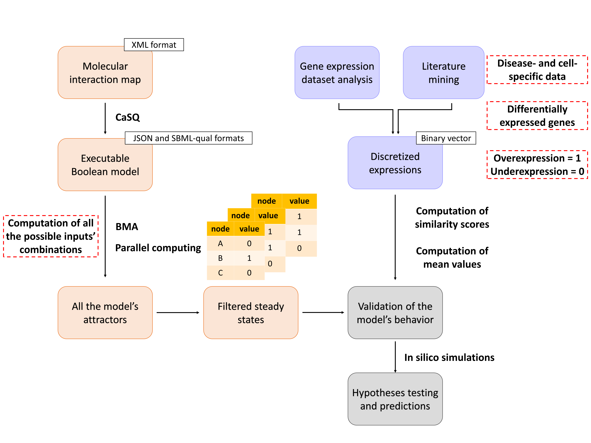

# A computational framework to build and calibrate large-scale Boolean models

- In this directory, you will find all the files and scripts used to generate and calibrate the RA M1 and M2 macrophage models using prior knowledge and RNA-seq data analysis.

- The figure bellow shows the framework used :

- This folder consists of:

1. Molecular_interaction_maps_XML_format folder: contains the XML files of the molecular interaction maps used to generate the corresponding Boolean models using CaSQ. RA_M1_macrophage.xml corresponds to the rheumatoid arthritis M1 macrophage cell type. RA_M2_macrophage.xml corresponds to the rheumatoid arthritis M2 macrophage cell type.
The XML files are converted to JSON files using the following command `casq -b -g 1 $XML_file_name $JSON_file_name`
example: 
`casq -b -g 1 RA_M1_macrophage.xml RA_M1_macrophage.json`

2. GSE97779_dataset_analysis folder: contains the script and files used to analyse the GSE97779 RNA-seq dataset  
- GSE97779_series_matrix, the gene expression matrix of the GSE97779 GEO dataset. 

- GPL570-55999.txt,a text file that was used to annotate the genes

- GSE97779_DEA.R, the R script used to perform differential expression analysis on GSE97779 dataset

- DEG_macrophage.xlsx, the resulting differentially expressed genes from the GSE97779 dataset

3. Extract_nodes_upstream_phenotype_of_interest : The folder comprises all the files and scripts used to extract nodes that are upstrem of the phenotypes of interest in both RA_M1_macrophage and RA_M2_macrophage models. 

- M1_model_export_upstream_phenotype_of_interest.sbml and M2_model_export_upstream_phenotype_of_interest.sbml are the SBML files that correspond to the submodules upstream of the phenotypes of interest in both RA M1 macrophage and RA M2 macrophage models respectively.
Both files were generated using CaSQ export option using the following command:
`casq $XML_file_name -u phenotypes of interest`
example:
`casq RA_M1_macrophage.xml -u apoptosis_M1_macrophage_phenotype`

- M1_macrophage_all_nodes_in_json.csv and M2_macrophage_all_nodes_in_json.csv correspond to the list of all the nodes present in the RA M1 macrophage and RA M2 macrophage models respectively in the JSON format.

- Extract_nodes_upstream_phenotypes_of_interest.py is the Python file used to extract the nodes that are upstrem of the phenotypes of interest in both RA_M1_macrophage and RA_M2_macrophage models. 

- M1_macrophage_nodes_upstream_phenotypes_in_json.csv and M2_macrophage_nodes_upstream_phenotypes_in_json.csv are the resulting files from the extraction process performed using Extract_nodes_upstream_phenotypes_of_interest.py file. They contain the list of nodes that are upstrem of the phenotypes of interest in both RA_M1_macrophage and RA_M2_macrophage models respectively in the JSON format.

4. Attractors_search : This folder contains all the files needed to run the attractors search for both RA M1 macrophage and RA M2 macrophage models and filter the resulting attractors to keep the stable states only.

- BioCheckConsoleMulti.zip is the prototype of the BMA console tool based on the open source .NET core 3.1 which can be built using the dotnet SDK.

- RA_M1_macrophage.json and RA_M2_macrophage.json files are the corresponding Boolean models in JSON format

- M1_all_inputs_with_fixed_ones.csv and M2_all_inputs_with_fixed_ones.csv contain the list of inputs present in both RA_M1_macrophage and RA_M2_macrophage models respectively. Some of the inputs are fixed based on observed values in the literature or in RNA-seq dataset

- Attractors_search.py is the Python script that uses the BMA console tool to run the attractors search for all the possible inputs combinations in the models.  

- Repository_preparation.txt is a text file to prepare the repository where the attractor search need to be run. It will build the BMA console tool in your linux based environment and copy all the needed files to run the Attractors search in the appropriate folder.
To do this, you just need to run the Repository_preparation.txt file using the following command:

`sh Repository_preparation.txt`
- Attractors_filtering.py is a Python script to filer the resulting attractors to keep the stable states only.

5. Attractors_filtering_based_on_similarity_scores folder: it contains all the files and scripts used to select the stable states with the highest similarity scores and to compute their average vector.

- M1_nodes_after_upstream_export_with_known_value_literature.csv and M2_nodes_after_upstream_export_with_known_value_literature.csv are csv files containing the nodes upstream of the phenotype of interest that are associated with observed Boolean values collected from the literature or/and dataset analysis. These observed values are used to calculate the similarity between the resulting stable states and prior knowledge

- similarity_score_computation.py is the Python script used to calculate similarity scores for all the stable states generated during the Attractors_search. 

- M1_similarity_score_on_nodes.csv and M2_similarity_score_on_nodes.csv are the resulting files from the similarity score computation. Each stable state is associated with a score that describe how close it is to the experimentally observed Boolean values.

- calculate_mean_vector_over_fixpoints_with_highest_similarity.py is a Python script to select the stable states with the highest similarity score and to compute the average vector over these selected stable states.

- M1_occurence_per_node_in_fixpoints_with_max_similarity_on_nodes.csv and M2_occurence_per_node_in_fixpoints_with_max_similarity_on_nodes.csv files correspond to the calibrated state for both RA_M1_macrophage and RA_M2_macrophage models respectively.

